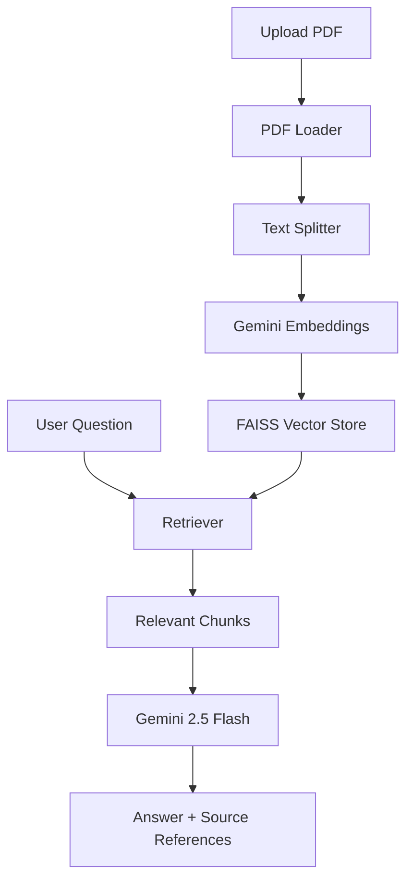
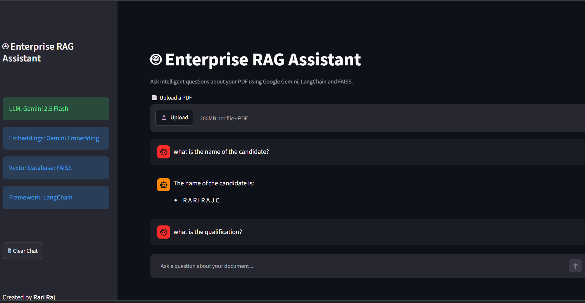

# 🤖 Enterprise RAG Assistant

A Retrieval-Augmented Generation (RAG) application that enables users to upload PDF documents and ask natural language questions using Google Gemini, LangChain, and FAISS.

---

## 🚀 Features

- 📄 Upload PDF documents
- 💬 Chat with your documents
- 🔍 Semantic search using FAISS
- 🧠 Google Gemini 2.5 Flash
- ✂️ Recursive text chunking
- 📚 Source references
- ⚡ Streamlit interface
- 💾 Cached vector store

---

## 🛠 Tech Stack

- Python
- Streamlit
- LangChain
- Google Gemini API
- FAISS
- RecursiveCharacterTextSplitter
- PyPDFLoader

---

## 📂 Project Structure

```text
app.py
utils/
uploaded_files/
faiss_index/
requirements.txt
README.md
```

---

## 🏗 Architecture



---

## ⚙️ Installation

```bash
git clone https://github.com/YOUR_USERNAME/Chat-with-PDF-RAG.git

cd Chat-with-PDF-RAG

python -m venv venv

venv\Scripts\activate

pip install -r requirements.txt
```

Create a `.env` file:

```text
GOOGLE_API_KEY=YOUR_API_KEY
```

Run:

```bash
streamlit run app.py
```

---

## 📸 Demo


---

## Future Improvements

- Multiple PDF Support
- Conversation Memory
- LangGraph Agents
- Hybrid Search
- Research Assistant Mode

---

## 👩‍💻 Author

**Rari Raj**

AI | Machine Learning | Generative AI